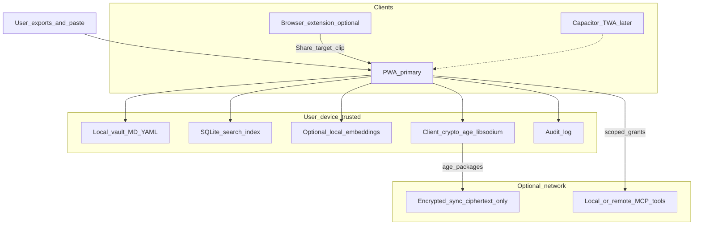
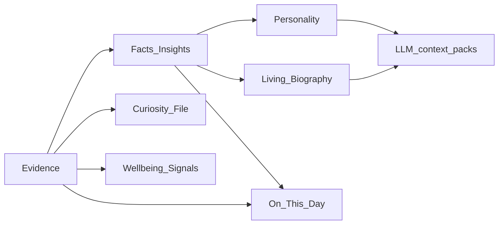
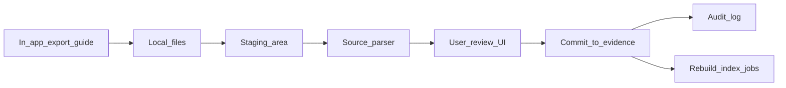

# SelfChronicle — Architecture

> **Status:** Planning document (high-level).  
> **Not implemented.** Guides Sprint 0–2 design; ADRs supersede details when written.  
> **Related:** [DATA_MODEL.md](./DATA_MODEL.md), [PRIVACY.md](./PRIVACY.md), [SECURITY.md](./SECURITY.md), [IMPORT_PIPELINE.md](./IMPORT_PIPELINE.md), [FOLDER_STRUCTURE.md](./FOLDER_STRUCTURE.md), [UX_FLOWS.md](./UX_FLOWS.md)

SelfChronicle is a **privacy-first, FOSS, local-first** personal memory and living biography system. It turns user-initiated exports and notes into a user-owned vault that can be inspected, edited, and selectively injected into LLMs and tools.

---

## 1. Goals and non-goals

### Goals

| Goal | Meaning |
|------|---------|
| Local-first | Full product value without accounts or network |
| User ownership | Export, delete, audit, and edit every layer |
| Injectability | Curated profile/context packages for any LLM |
| Provenance | Every claim traces to evidence or user edit |
| Soft psychology | Personality / wellbeing signals are provisional and editable |
| FOSS | MIT (bootstrap default); no proprietary cloud lock-in |

### Non-goals (v1)

- Silent scraping of phone LLM chats or background OS monitoring
- Clinical diagnosis or therapy replacement
- Server-side plaintext search / RAG over user vaults
- Mandatory accounts or ads

---

## 2. System overview



**Primary client:** installable **PWA** (offline-capable).  
**Secondary (planned):** thin **Node** host for local MCP / CLI tools (`examples/node` → later `apps/mcp-host`).  
**Later:** Capacitor / TWA wrappers around the same vault APIs; browser extension / Web Share Target for import convenience.

---

## 3. Stack defaults (locked for bootstrap)

| Layer | Choice | Notes |
|-------|--------|-------|
| Primary UI | Web / Vite + TypeScript PWA | `examples/web` Golden Path |
| Optional tools host | Node (Hono) | Local MCP server, import CLIs |
| License | MIT | Matches bootstrap |
| Pruned stacks | Android, Python, Rust, Go, Lightroom | Reintroduce via ADR when needed |
| Sync crypto | **age** (X25519 + ChaCha20-Poly1305) | See [SECURITY.md](./SECURITY.md) |
| Local AEAD / streams | libsodium (WASM) | Attachments, sensitive sections |
| KDF | Argon2id | Passphrase → master key |
| Search index | SQLite (WASM or native via later wrapper) | FTS + metadata; vault source of truth remains files |
| Embeddings | Optional, on-device only | Never required for core biography |

---

## 4. Local vault

### 4.1 Design principle

**Source of truth = plain files** the user can open in any editor:

- Markdown bodies for narrative, evidence notes, biography chapters
- YAML frontmatter for IDs, dates, tags, links, confidence
- Small YAML/JSON sidecars only when frontmatter would be unwieldy

**Structured store (SQLite)** is a **derived index** for search, On This Day, embeddings pointers, and import job state. Rebuildable from the vault.

### 4.2 Vault root layout (logical)

```
vault/
  meta.yaml                 # vault id, schema version, created_at
  evidence/                 # raw imports & day notes
  facts/                    # durable claims
  insights/                 # patterns (soft)
  personality/              # versioned profile docs
  biography/                # Living Biography chapters
  curiosity/                # question queue
  wellbeing/                # soft signals (opt-in)
  on-this-day/              # optional materialized day keys
  attachments/              # binary blobs (hashed filenames)
  imports/                  # import job manifests + raw staging
  audit/                    # append-only style event log (files)
  _index/                   # app-managed SQLite + caches (regenerable)
```

See [DATA_MODEL.md](./DATA_MODEL.md) for schemas and [FOLDER_STRUCTURE.md](./FOLDER_STRUCTURE.md) for repo vs vault paths.

### 4.3 Offline & installability

- Service worker caches app shell
- Vault lives in OPFS / IndexedDB-backed FS abstraction (PWA) or real filesystem (desktop wrapper later)
- “Works on airplane mode” is a release criterion for core read/write and Day Close

---

## 5. Compilation pipeline (layers)

Data flows **upward** from evidence; user edits at any layer are first-class.



| Layer | Produced by | User control |
|-------|-------------|--------------|
| Evidence | Imports, paste, Day Close, manual notes | Edit/delete always |
| Facts / Insights | Extraction (local LLM or rules) + confirm | Edit, reject, pin |
| Personality | Synthesis over facts | Full rewrite; versioned |
| Living Biography | Narrative compile | Chapter-level edit; freeze sections |
| Curiosity | Gaps / user questions | Prioritize, snooze, dismiss |
| Wellbeing | Soft heuristics | Edit, disable globally |
| On This Day | Date index | Hide items; no auto-share |

**Living Biography** is a *compiled, user-editable narrative*—never an immutable AI dump.

---

## 6. Optional encrypted cloud sync

- **Opt-in only**; default is local-only
- Client encrypts vault packages with **age** before upload
- Sync provider stores **ciphertext only** (zero-knowledge relative to operators)
- Conflict strategy (v1 proposal): last-writer-wins per file path + audit event; manual merge UI later
- Remote wipe / unlink must delete remote ciphertext when user requests vault destroy

Details: [PRIVACY.md](./PRIVACY.md), [SECURITY.md](./SECURITY.md).

---

## 7. MCP / tool integration

Purpose: let Cursor, Claude Code, and similar agents **read scoped context** or **append evidence** with explicit grants.

| Mode | Transport | Trust |
|------|-----------|-------|
| Local MCP host | `examples/node` → stdio/HTTP localhost | Same machine; still require grants |
| Remote MCP | User-configured | Untrusted; plaintext only for authorized scope |

**Proposed tools (planning names):**

- `vault.search` — FTS over authorized paths
- `vault.get_profile_pack` — curated injection bundle (biography slice + pinned facts)
- `vault.append_evidence` — add a note with provenance `source: mcp`
- `vault.list_curiosity` — open questions (read)
- `vault.export_pack` — build a dated context pack file

**Guardrails:**

- No tool runs without user permission (session or per-call)
- Default deny whole-vault read
- Audit every grant and tool invocation
- Warn that external models may retain authorized plaintext

UX: [UX_FLOWS.md](./UX_FLOWS.md). Security: [SECURITY.md](./SECURITY.md).

---

## 8. Browser extension & share target

**Goals:** reduce friction for “save this conversation / page” without scraping.

| Mechanism | Behavior |
|-----------|----------|
| Web Share Target (PWA) | Receive shared text/files into import staging |
| Browser extension (later) | Explicit “Send to SelfChronicle” on selection or export file |
| Clipboard paste | In-app paste → evidence with provenance `manual_paste` |

**Never:** background capture of LLM UIs, accessibility-tree scraping, or silent keylogging.

---

## 9. Native wrappers (later)

| Wrapper | When | Constraint |
|---------|------|------------|
| TWA (Android) | After PWA stable | Same origin / vault bridge |
| Capacitor | If store APIs or FS access needed | Reuse vault core; no second data model |
| Desktop (Tauri/Electron) | If OPFS limits hurt power users | Real FS vault path preference |

Android Golden Path is **pruned** until an ADR reintroduces it.

---

## 10. Import architecture

Imports are **user-guided pipelines**: pick source → follow in-app export instructions → select files → parse locally → review → commit to evidence.



Parsers never phone home. Large archives stream to staging; raw blobs optional retain/delete. Full source matrix: [IMPORT_PIPELINE.md](./IMPORT_PIPELINE.md).

---

## 11. LLM usage (on-device vs user BYOK)

| Use | Default |
|-----|---------|
| Fact extraction / biography compile | User-selected: local model **or** BYOK remote with explicit send |
| Evening ritual | Local templates first; LLM optional |
| Injection into external chats | User copies pack or MCP grant |

Remote LLM calls for vault content are **always explicit** (preview payload size + confirm).

---

## 12. Application architecture pattern

**Decision (default):** Hexagonal / ports-and-adapters around a vault core.

- **Domain:** evidence, facts, biography, curiosity, wellbeing rules
- **Ports:** `VaultStore`, `SearchIndex`, `SyncTransport`, `ImportParser`, `LlmPort`, `McpGrantStore`
- **Adapters:** OPFS/FS, SQLite, age sync, PWA UI, Node MCP

ADR-0001 should be filled to lock this (currently template stub).

---

## 13. Deployment & distribution

| Artifact | Channel |
|----------|---------|
| PWA | GitHub Pages / static host (no server-side vault) |
| Optional sync | User-chosen backend or future SelfChronicle ciphertext store |
| Releases | GitHub Releases; `.app-update.json` seeded to `edwardlthompson/selfchronicle` |

Core app remains usable as static assets + local storage.

---

## 14. Open design questions (non-blocking defaults)

| Question | Default until ADR |
|----------|-------------------|
| OPFS vs File System Access API for power users | OPFS default; optional “bind folder” later |
| Embedding model | None in v1; add on-device later |
| Multi-device sync conflicts | LWW per file + audit |
| Biography compile schedule | On demand + after import batches |

---

## 15. Success criteria (architecture)

1. New user can install PWA, create vault, import one ChatGPT/Grok export, offline, no account.  
2. Optional sync uploads only age ciphertext.  
3. MCP cannot read vault without a visible grant.  
4. User can export full vault as zip of Markdown/YAML and delete local copy.  
5. Living Biography remains editable Markdown after any compile step.
