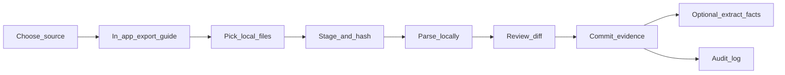

# SelfChronicle — Import Pipeline

> **Status:** Planning document.  
> **Hard rule:** No silent scraping of phone LLM chats or background capture.  
> Only **user-initiated official exports** and **manual import / paste / share**.  
> **Related:** [ARCHITECTURE.md](./ARCHITECTURE.md), [DATA_MODEL.md](./DATA_MODEL.md), [PRIVACY.md](./PRIVACY.md), [UX_FLOWS.md](./UX_FLOWS.md)

---

## 1. Pipeline stages (all sources)

| Stage | Requirements |
|-------|----------------|
| Guide | Step-by-step export instructions **inside the app** (and mirrored here) |
| Stage | Hash files; never upload |
| Parse | Source-specific adapter; streaming for large archives |
| Review | Show counts, date range, sample items; allow exclude |
| Commit | Write Markdown evidence + manifest; optional delete raw |
| Extract | Separate opt-in job; never auto-publish facts without review mode setting |

**Defaults:** retain_raw = false after successful commit; fact extraction = prompt later.

---

## 2. Common UX copy principles

- Warm, non-judgmental; remind users exports may include other people’s data
- Show **what will be stored** before commit
- Always offer **Cancel** and **Delete staging**
- Link to Privacy summary

---

## 3. Source adapters

### 3.1 Grok / xAI account data export (JSON)

| Field | Value |
|-------|-------|
| Source key | `grok_export` |
| Expected inputs | Official xAI/Grok data export archive or conversation JSON |
| Parser | `grok_json_v1` |

**In-app user instructions (draft):**

1. Open Grok in your browser (or the X/xAI account portal that provides **Download your data**).  
2. Request an official **account / data export** (not a screenshot).  
3. Wait for the export email or download notice from xAI/X.  
4. Download the zip/JSON to this device.  
5. In SelfChronicle → **Import → Grok** → choose the file.  
6. Review conversations listed → **Commit to vault**.

**Notes for implementers:** Export schemas change; pin parser version; unknown fields preserved in `raw_sidecar` optional JSON under the import job.

---

### 3.2 ChatGPT (OpenAI export)

| Field | Value |
|-------|-------|
| Source key | `chatgpt_export` |
| Expected inputs | `conversations.json` (and related) from OpenAI “Export data” |
| Parser | `chatgpt_export_v1` |

**In-app user instructions (draft):**

1. Go to [ChatGPT](https://chatgpt.com) → profile → **Settings**.  
2. Open **Data controls** (wording may vary).  
3. Choose **Export data** and confirm.  
4. Open the email from OpenAI and download the zip.  
5. Unzip if needed; in SelfChronicle → **Import → ChatGPT** → select `conversations.json` or the zip.  
6. Review → Commit.

---

### 3.3 Claude (Anthropic export)

| Field | Value |
|-------|-------|
| Source key | `claude_export` |
| Expected inputs | Official Anthropic/Claude data export package |
| Parser | `claude_export_v1` |

**In-app user instructions (draft):**

1. Sign in to Claude (claude.ai or Anthropic account settings).  
2. Open **Settings → Privacy / Data** (labels vary).  
3. Request **Export / Download your data**.  
4. Download the archive when ready.  
5. SelfChronicle → **Import → Claude** → select the archive.  
6. Review → Commit.

---

### 3.4 Gemini (Google)

| Field | Value |
|-------|-------|
| Source key | `gemini_export` |
| Expected inputs | Google Takeout including Gemini / Bard activity, or Gemini export bundle |
| Parser | `gemini_takeout_v1` |

**In-app user instructions (draft):**

1. Open [Google Takeout](https://takeout.google.com).  
2. Select **Gemini** / **Bard** / related Gemini activity (deselect unrelated services for a smaller archive).  
3. Export and download when Google signals ready.  
4. SelfChronicle → **Import → Gemini** → select the Takeout zip.  
5. Review → Commit.

---

### 3.5 Gmail (Google Takeout / MBOX)

| Field | Value |
|-------|-------|
| Source key | `gmail_takeout` / `mbox` |
| Expected inputs | Takeout Gmail mailbox (MBOX) or `.mbox` file |
| Parser | `mbox_v1` |

**In-app user instructions (draft):**

1. Open [Google Takeout](https://takeout.google.com).  
2. Select **Mail** only (or your preferred labels if Takeout allows).  
3. Choose export format that includes **MBOX**.  
4. Download and unzip; locate the `.mbox` file(s).  
5. SelfChronicle → **Import → Gmail / MBOX** → select files.  
6. **Strongly recommended:** set a date range and folder filters in review.  
7. Commit.

**Privacy caution:** Email archives are large and sensitive; default to filtered import.

---

### 3.6 WhatsApp chat exports

| Field | Value |
|-------|-------|
| Source key | `whatsapp_export` |
| Expected inputs | WhatsApp “Export chat” `.txt` / `.zip` (with or without media) |
| Parser | `whatsapp_txt_v1` |

**In-app user instructions (draft):**

1. In WhatsApp, open the chat (or group) → menu → **More → Export chat**.  
2. Choose **Without media** (smaller) or **Include media**.  
3. Save/share the file to this device (Files, Drive, etc.).  
4. SelfChronicle → **Import → WhatsApp** → select the export.  
5. Review participants & date range → Commit.

**Note:** There is no bulk “all chats” official export on all platforms; users import chat-by-chat. Document this limitation in UI.

---

### 3.7 Facebook / Meta — Download Your Information

| Field | Value |
|-------|-------|
| Source key | `meta_dyi` |
| Expected inputs | Meta DYI zip (JSON or HTML); prefer JSON |
| Parser | `meta_dyi_v1` (messages, posts, comments subsets) |

**In-app user instructions (draft):**

1. Open Meta **Accounts Center** → **Your information and permissions** → **Download your information**  
   (or Facebook Settings → Your Facebook Information → Download Your Information).  
2. Select types: at minimum **Messages** and/or **Posts** (avoid requesting everything unless needed).  
3. Format: **JSON**, media quality low if you only need text.  
4. Request download; when ready, download the zip.  
5. SelfChronicle → **Import → Meta / Facebook** → select zip.  
6. Pick subsets (messages, posts) → Review → Commit.

---

### 3.8 Other messaging / social archives

| Field | Value |
|-------|-------|
| Source key | `other_archive` |
| Expected inputs | Zip/folder with text or JSON; best-effort |
| Parser | `generic_archive_v1` |

**In-app user instructions (draft):**

1. Use the platform’s **official download / export** feature only.  
2. Save the archive locally.  
3. SelfChronicle → **Import → Other archive**.  
4. Map files (which folder is messages vs posts) if prompted.  
5. Review → Commit.

Unsupported proprietary formats show a clear “can’t parse yet” state and offer **Manual paste**.

---

### 3.9 Manual paste / share sheet

| Field | Value |
|-------|-------|
| Source key | `manual_paste` / `share_target` |
| Expected inputs | Clipboard text, shared files, drag-and-drop |

**In-app user instructions (draft):**

1. Copy text from a chat or note **you are allowed to save**.  
2. In SelfChronicle → **Import → Paste**, or use **Share → SelfChronicle** (PWA share target / later extension).  
3. Add a title and optional date.  
4. Save as evidence.

**Extension (later):** toolbar button “Send selection to SelfChronicle” — still user-initiated.

---

## 4. Forbidden acquisition methods

| Method | Status |
|--------|--------|
| Accessibility-service scraping of ChatGPT/Claude/Grok apps | **Forbidden** |
| Overlay / keylog / screenshot pipelines without explicit per-capture consent | **Forbidden** |
| Harvesting cookies to pull cloud chats silently | **Forbidden** |
| Bundled “auto sync my AI chats” without official export | **Forbidden** |

If a vendor later offers an **OAuth + official API** with user consent, that may be added via ADR—still never silent.

---

## 5. Review UI requirements

Before commit, show:

- Source + parser version  
- Number of threads/messages/files  
- Date min/max  
- Sample of 3 normalized items  
- Toggles: include media, retain raw, exclude threads  

After commit:

- Link to new evidence folder  
- Offer **Run fact extraction** (optional)  
- Offer **Delete staging/raw**

---

## 6. Error handling

| Case | Behavior |
|------|----------|
| Unknown schema | Fail soft; keep staging; show “export format changed” |
| Partial zip | Import readable parts; list skips |
| Corrupt file | Error + hash in manifest |
| Huge mailbox | Require date filter before parse |

---

## 7. Security & privacy during import

- All parsing **on device**  
- No telemetry of filenames or content  
- Warn when `contains_third_parties` likely (group chats, email)  
- Attachments scanned only for type/size (not cloud AV that uploads content)

---

## 8. Implementation order (suggested)

1. Manual paste + share target  
2. ChatGPT export  
3. Grok JSON  
4. Claude export  
5. WhatsApp txt  
6. Gemini Takeout  
7. MBOX / Gmail  
8. Meta DYI  
9. Generic archive  

Each adapter ships with fixture files under `packages/importers/fixtures/` (future) and golden Markdown snapshots—**not implemented in this planning pass**.

---

## 9. Testing checklist (planning)

- [ ] Each official export fixture parses without network  
- [ ] Re-import same file is idempotent (stable `source_id` → update or skip)  
- [ ] User can abort staging with zero vault writes  
- [ ] Audit contains `import.commit` with counts only (no message bodies)
