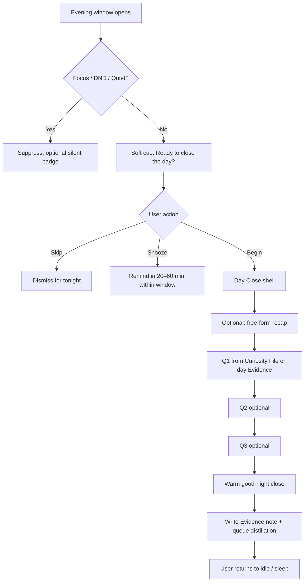
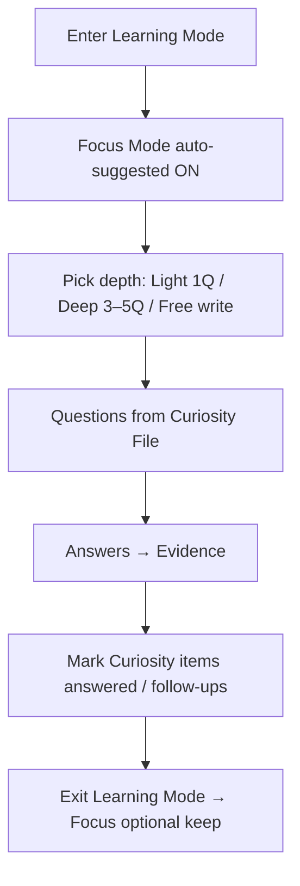

# SelfChronicle UX Flows

Planning-only. No UI implementation. Primary client: **PWA**. Copy and structure assume a local vault of Markdown notes with YAML frontmatter.

## Defaults (locked for this plan)

| Decision | Default |
|---|---|
| Primary client | Progressive Web App (installable, offline-capable) |
| Tone | Warm, reflective, non-clinical |
| Day Close prompts | Local notifications only if user-granted; otherwise in-app soft cue |
| Quiet / focus | Default quiet hours + focus-aware suppression |
| MCP permissions | Explicit per-session or per-action prompts |
| Evening ritual | Opt-in; max **3** questions |
| Scraping | Never silent — user-initiated export + manual import only |

## Layer language (use consistently in UI)

| Layer | User-facing name | Role in UX |
|---|---|---|
| Evidence | Evidence | Raw day notes, imports, Day Close answers, attachments |
| Facts/Insights | Facts & Insights | Distilled, editable claims drawn from Evidence |
| Personality | Personality | Soft psychological / preference profile (provisional) |
| Living Biography | Living Biography | Compiled narrative chapters the user can edit |
| Curiosity File | Curiosity File | Open questions SelfChronicle may gently ask |
| Wellbeing Signals | Wellbeing Signals | Soft, provisional, always user-editable signals |
| On This Day | On This Day | Anniversary / “this day” resurfacing cards |

Vault mental model in copy: *“Your vault is plain Markdown with frontmatter—you can open it in any editor.”*

---

## 1. Evening Reflection Ritual (“Day Close”)

### Goals
- Offer a short, warm closing ritual near typical bedtime.
- Capture at most three reflective answers (or a free-form recap).
- Feed answers into Evidence → (pipeline) Facts/Insights → Personality → Living Biography → Wellbeing Signals.
- Never interrupt coding or deep work.

### Preconditions
- Feature toggle: **Day Close** is off by default until opt-in.
- User has set (or confirmed) a preferred window: e.g. “around 9:30–10:30 pm” or “30 min before I usually sleep.”
- Notification permission is optional; ritual still works as an in-app cue.

### Entry points
1. **Scheduled soft cue** (preferred): local notification or in-app banner in the Day Close window.
2. **Manual**: Home / Today → “Close the day.”
3. **Snooze resume**: banner “Still want to close yesterday?” next morning (gentle, dismissible).

### Non-interruption rules (must all pass before any prompt)

```
Allow Day Close prompt ONLY IF:
  ✓ Day Close opted in
  ✓ Current local time within user’s Day Close window OR user opened ritual manually
  ✓ Not in Quiet Hours (default: user-configured; suggest overnight core sleep)
  ✓ Focus / DND not active (see Focus Detection below)
  ✓ No active “Deep Work” session marked by user or detected
  ✓ Not mid-import / mid-export / mid-MCP write confirmation
  ✓ Device not reporting “busy” signals that we treat as focus (optional)
```

#### Focus detection (PWA-realistic)

| Signal | Behavior |
|---|---|
| OS / browser notification quiet / DND | Suppress local notifications; keep in-app cue only if app is foreground and idle |
| User Focus Mode toggle in SelfChronicle | Hard suppress until ended or until next calendar day after bedtime window |
| Schedule windows | Day Close only inside configured evening window |
| App usage heuristic (soft) | If user has been actively typing in Learning Mode or editing Biography for <N minutes, delay cue |
| Coding / deep work | Prefer **explicit** Focus Mode + optional calendar “Focus/Deep Work” busy blocks; do not scrape IDE telemetry |
| Never | Inject overlays into other apps; never steal focus from coding tools |

Principle: **absence of scrape**. We do not hook into IDEs. User marks Focus, uses OS DND, or we respect schedule windows.

### Happy path (max 3 questions)



### Question selection
1. Prefer unanswered items from **Curiosity File** tagged `evening` or `soft`.
2. Else generate up to 3 prompts from **today’s Evidence** (imports, notes, On This Day echoes)—framed as curiosity, not interrogation.
3. User may replace any question with free-form writing.
4. Hard cap: **3** prompted questions per ritual; free-form recap does not count against the 3 if presented as optional first step—or count as replacing Q1 (product choice: **optional recap + up to 3 questions**, but UI must feel short; recommended UX: *recap OR questions*, with “add a note” always available).

**Recommended UX decision:** Screen 1 = optional free-form “How was today?”; Screens 2–4 = up to 3 questions, each skippable; total interactive steps feel ≤ 4; empty skip of all still allowed with good-night.

### Skip / snooze
- **Skip tonight** — one tap; no guilt copy.
- **Snooze** — 20 / 40 / 60 minutes, still bound by Day Close window end.
- **Not tonight / pause for a week** — from overflow menu.
- Skipped rituals do not invent Evidence.

### Warm good-night close
- Short blessing-style line (non-religious default variants), e.g. “Rest well. Tomorrow’s page is blank and waiting.”
- Show 1-line summary of what was saved (“Saved to Evidence · will gently update your Biography overnight if you allow background sync/compile”).
- Optional: dim theme / slow fade; no streaks, no scores.

### Data path (UX promise)
```
Day Close answers
  → Evidence (Markdown note, frontmatter: type: evidence, source: day-close, date)
  → user-visible queue: “Reflecting…” (Facts/Insights candidates)
  → Personality / Wellbeing Signals updates marked provisional
  → Living Biography may gain a light daily stitch (user-editable)
```
All derived items remain **auditable and editable** from Profile Dashboard.

### Empty / edge states
- No Evidence today → softer questions from Curiosity File only.
- Travel / timezone change → recompute window in local TZ; one-time confirm banner.
- Missed several nights → never stack guilt; at most one “catch up yesterday?” offer.

---

## 2. Profile Dashboard

### Goals
- One calm home for the self: narrative, personality, facts, timeline, On This Day, reflective stats.
- Full audit & edit for every stored item.
- Share Living Biography intentionally (export / link / copy)—never ambient public.

### Information architecture

```
Profile Dashboard
├── Living Biography (hero narrative)
├── Personality summary
├── Wellbeing Signals (soft strip)
├── Key Facts
├── Life Timeline
├── On This Day / This Day X Years Ago
├── Insights & reflective stats
└── Audit & Vault (all items)
```

### Living Biography
- Readable chapters (Markdown), compiled from Facts/Insights + Evidence.
- Actions: Edit chapter · Regenerate section (with preview/diff) · Export / Share pack · Copy excerpt.
- Always show “Compiled from your Evidence · you can edit anything.”
- Shareable = explicit export (Markdown/PDF/share sheet), not a public profile by default.

### Personality & psychological profile
- Summary cards with **provisional** language (“You often seem…”, “Lately you’ve noted…”).
- Each claim links to supporting Evidence / Facts.
- Edit, soften, delete, or “don’t use this in Biography.”

### Key facts & life timeline
- Facts list (YAML-backed) with source links.
- Timeline: chronological spine; tap → Evidence / Fact detail.
- On This Day cards surface above the fold when relevant.

### On This Day / This Day X Years Ago
- Cards from dated Evidence / Facts.
- Actions: Remember · Add a note · Hide this anniversary · Open source Evidence.
- Tone: nostalgic, not clinical.

### Stats & insights (inspiring, not clinical)
- Prefer: “Days you closed with a note,” “Themes this month,” “Places that keep appearing.”
- Avoid: diagnostic scores, disorder language, traffic-light health UI.
- Wellbeing Signals shown as soft weather metaphors or gentle labels, always editable.

### Audit & edit (global)
- Every item: view source layer, edit Markdown/frontmatter fields (friendly form + raw toggle), delete, export.
- “Why is this here?” explains derivation path in plain language.

### Primary flows

**Read Biography**
`Dashboard → Living Biography → chapter → edit or share`

**Correct a wrong fact**
`Dashboard → Key Facts → item → Edit / Unlink Evidence → Save → optional Biography refresh`

**On This Day engage**
`Dashboard → On This Day card → Add note (Evidence) or Open past Evidence`

**Full audit**
`Dashboard → Audit & Vault → filter by layer → open item`

---

## 3. Learning Mode

### Goals
- Dedicated space for deeper Curiosity File questions **outside** task-relevant assistant chatter.
- User chooses when to learn; SelfChronicle does not hijack work sessions.

### Separation from task-relevant questioning
| Mode | When | Question style |
|---|---|---|
| Task-relevant (future assistant / MCP consumers) | Only if user enables “help me remember while I work” | Minimal, contextual, deferrable |
| **Learning Mode** | Explicit enter | Deeper, exploratory, from Curiosity File |

Learning Mode is a **destination**, not a popup.

### Flow



### UX rules
- Banner: “You’re in Learning Mode — deeper questions live here, not during work.”
- Can pin themes (family, career, health-as-story, creativity).
- Exit is always one tap; partial answers save as Evidence drafts.
- Day Close may reuse unanswered Curiosity items; Learning Mode is the deep well.

---

## 4. Cross-LLM Memory Handoff

### Goals
- Portable profile the user can paste or attach into any LLM.
- MCP tools for Cursor, Claude Code, etc., with **explicit** permission.

### Portable export (prompt + files)
1. User opens **Handoff → Export for any LLM**.
2. Chooses layers: Personality · Key Facts · Living Biography excerpts · Wellbeing (optional, default off) · Curiosity open questions.
3. Generates:
   - `HANDOFF.md` — system/prompt preamble (warm, first-person or third-person toggle).
   - Selected Markdown files / pack (zip or folder).
4. Actions: Copy prompt · Download pack · Show “how to attach in ChatGPT / Claude / Cursor.”

See [MCP_HANDOFF.md](./MCP_HANDOFF.md) for MCP tool shapes and permission UX.

### Permission model (UX)
- First connect: explain vault access scopes (read Evidence, write Evidence, read Biography, etc.).
- Default: **per-session** grant with countdown/summary.
- Sensitive writes (Personality, Wellbeing, Biography overwrite): **per-action** confirm.
- Always visible “What AI tools can see right now” panel.

### Flow sketch
```
Handoff Center
  → Export pack (offline files)
  → Connect MCP client (permission session)
  → Client reads/writes via tools
  → Activity log in Audit & Vault
```

---

## Cross-cutting UX principles

1. **Local-first** — offline works; cloud sync is optional and encrypted (copy points to Privacy doc when present).
2. **No silent scraping** — imports are user-initiated; see Import doc when available.
3. **Provisional language** for Personality & Wellbeing Signals.
4. **User owns data** — raw Markdown vault, export anytime, delete anytime.
5. **Never interrupt deep work** — Focus Mode, quiet hours, schedule windows, no IDE hooks.
6. **Max 3** evening questions — hard product rule.
7. **FOSS trust** — settings explain what runs locally vs optional sync.

## Open questions for later architecture alignment
- Exact compile cadence for Living Biography after Day Close (on-device immediate vs deferred).
- Whether free-form recap counts toward the 3-question cap (this plan recommends optional recap + up to 3).
- PWA push limitations on iOS — document graceful degradation to in-app cues only.
